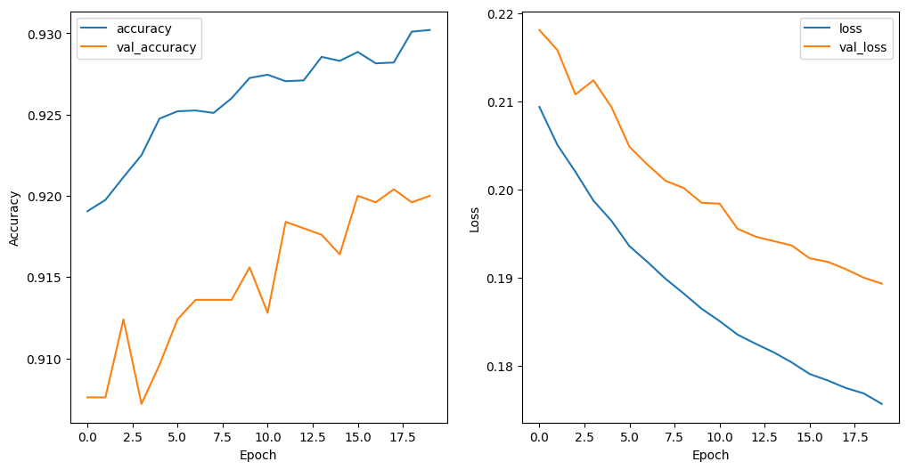
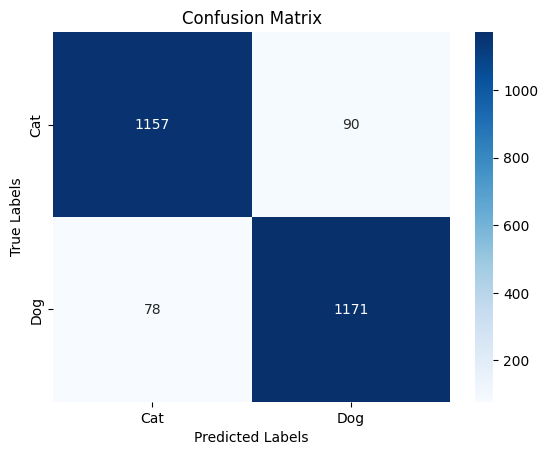
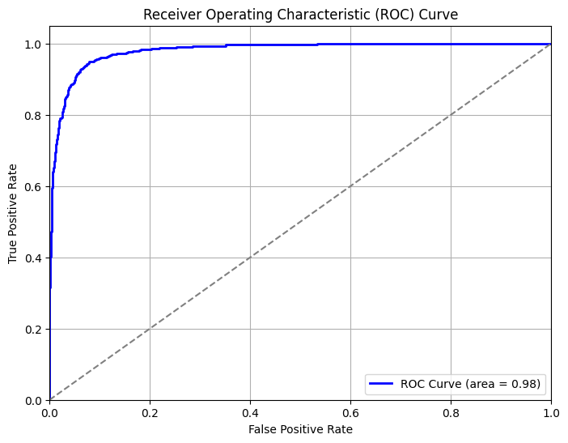

# Cats and Dogs Classification with CNN

This repository contains a Convolutional Neural Network (CNN) model developed to classify images of cats and dogs using a pre-trained VGG16 model as a base. The project demonstrates the use of transfer learning, data augmentation, and performance evaluation metrics.

## Project Overview

The primary goal of this project is to accurately classify images of cats and dogs. A transfer learning approach is employed by using a pre-trained VGG16 model with fine-tuning for binary classification. This model is valuable for applications requiring accurate image classification in a low-data setting.

## Dataset

- **Source**: [Kaggle Cats and Dogs Dataset](https://www.kaggle.com/c/dogs-vs-cats/data)
- **Classes**: Binary classification (Cats vs. Dogs).
- **Data Split**: The dataset is split into training, validation, and test sets.
- **Augmentation**: Data augmentation techniques (rescaling, etc.) were applied to the training data to improve generalization.

## Model Architecture

The model is based on the VGG16 architecture pre-trained on ImageNet. The architecture is as follows:
1. **VGG16 Base Model**: Pre-trained on ImageNet, with frozen layers to retain pre-learned features.
2. **GlobalAveragePooling2D Layer**: Reduces the output to a single value per filter.
3. **Dense Layer**: A fully connected layer with a sigmoid activation function for binary classification.

The model uses the Adam optimizer with binary cross-entropy as the loss function.

## Training

1. **Data Preprocessing**: Images were resized to 224x224 pixels and normalized.
2. **Training and Validation**: The model was trained with early stopping to prevent overfitting.
3. **Callbacks**:
    - **EarlyStopping**: Monitors validation loss to stop training when no improvement is observed.

### Model Performance

- **Final Training Accuracy**: ~92.93%
- **Validation Accuracy**: ~92.00%
- **Test Accuracy**: ~93.27%
- **Test Loss**: 0.1843

### Evaluation

The model achieved an accuracy of **93.27%** on the test set. The following visualizations represent the model's performance:

#### Accuracy and Loss Over Epochs

#### Confusion Matrix

#### ROC Curve

## Sample Predictions

Sample predictions showcase the model’s performance on various test images.

## Conclusion

This project demonstrates the application of CNNs in binary image classification, specifically for recognizing cats and dogs. With a test accuracy of over 93%, the model proves effective in distinguishing between the two classes.

## License

This project is licensed under the MIT License - see the LICENSE file for details.
